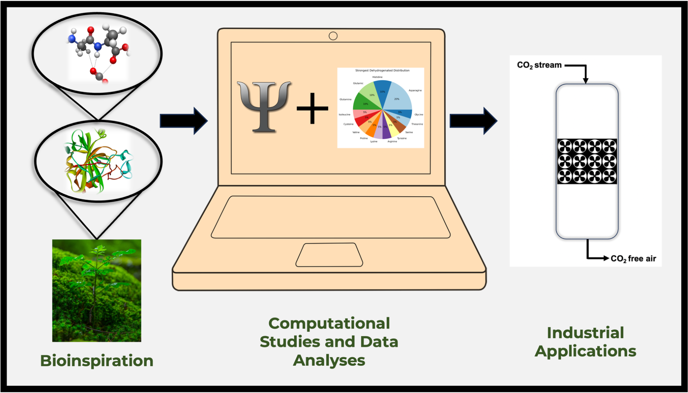

# dipeptide_co2

This is a repository for the following paper:
[Sylvanus, A., Jones, G., Custelcean, R., & Vogiatzis, K. "In Silico Screening of CO2‐Dipeptide Interactions for Bioinspired Carbon Capture". ChemPhysChem, e202400498.](https://doi.org/10.1002/cphc.202400498)


Please cite the following:
```
@article{sylvanussilico,
  title={In Silico Screening of CO2-Dipeptide Interactions for Bioinspired Carbon Capture},
  author={Sylvanus, Amarachi and Jones, Grier and Custelcean, Radu and Vogiatzis, Konstantinos},
  journal={ChemPhysChem},
  pages={e202400498},
  publisher={Wiley Online Library}
}
```

## File structure
- **Amino acid energies**: 20_AA_CO2_interaction_energy_DFT_PBE0D3BJ_def2TZVPP.xlsx (From: Accurate Interaction Energies of CO2 with the 20 Naturally Occurring Amino Acids)[https://doi.org/10.1002/cphc.202300027]
- **Spread sheet containing dipeptide data**: 400_dipeptides_interaction_energy_UPDATED2.xlsx
- **XYZ coordinates for the amino-acids interacting with CO2**: AA_CO2_coordinates
- **XYZ coordinates for the amino-acids**: AA_coordinates
- **Path containing some useful Excel files**: data_xlsx
- **XYZ coordinates for the dipeptides interacting with CO2**: dipeptides_co2_coordinates
- **XYZ coordinates for the dipeptides**:dipeptides_coordinates
- **Where all the images go**: images
- **Where the data from interaction_sites.ipynb is analyzed**: insights.ipynb
- **interaction_site_dist.xlsx
- **Where we create the spreadsheets for the analysis**: interaction_sites.ipynb
